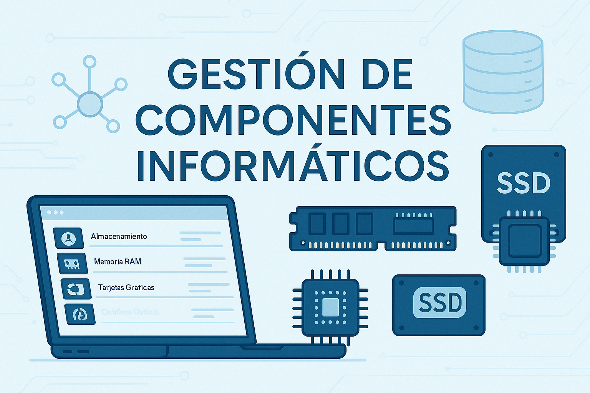

# Aplicación de gestión de componentes informáticos

Este proyecto es una aplicación web desarrollada con Python como parte del curso de programación de Tokio School. Está orientada a la gestión de productos y proveedores dentro de una empresa de suministros informáticos.

## 🛠️ Funcionalidades principales

- Gestión de productos informáticos clasificados por tipo (procesadores, memorias RAM, SSD, tarjetas gráficas, etc.).
- Gestión de proveedores.
- Control de usuarios con interfaz gráfica.
- Visualización de estadísticas básicas.
- Subida de imágenes para cada componente.

## 📦 Tecnologías utilizadas

- **Python 3**
- **SQLite** como base de datos
- **HTML / CSS / JS** para la interfaz
- **Flask** (o similar) como backend web
- Estructura organizada en carpetas: `templates`, `static`, `uploads`, `database`, etc.

## ▶️ Cómo ejecutar el proyecto

1. Clona este repositorio:
   ```bash
   git clone https://github.com/tuusuario/nombre-del-repositorio.git
   cd nombre-del-repositorio/EmPrIn
   ```

2. Crea un entorno virtual (opcional pero recomendado):
   ```bash
   python -m venv venv
   source venv/bin/activate  # o venv\Scripts\activate en Windows
   ```

3. Instala las dependencias:
   ```bash
   pip install -r requirements.txt
   ```

4. Ejecuta la aplicación:
   ```bash
   python main.py
   ```

5. Abre el navegador en `http://localhost:5000` (o el puerto configurado) para empezar a usarla.

## 📁 Estructura de carpetas destacada

```
EmPrIn/
├── main.py
├── db.py
├── models.py
├── templates/
├── static/
│   ├── css/
│   ├── js/
│   └── uploads/
├── database/
│   ├── store_componentes.db
│   └── store_componentes.sql
├── requirements.txt
```

## 👤 Autor

Adrián Pallardó Bernabé

---
